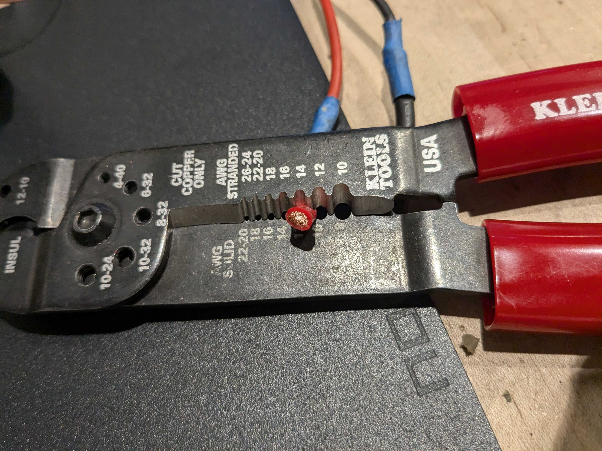
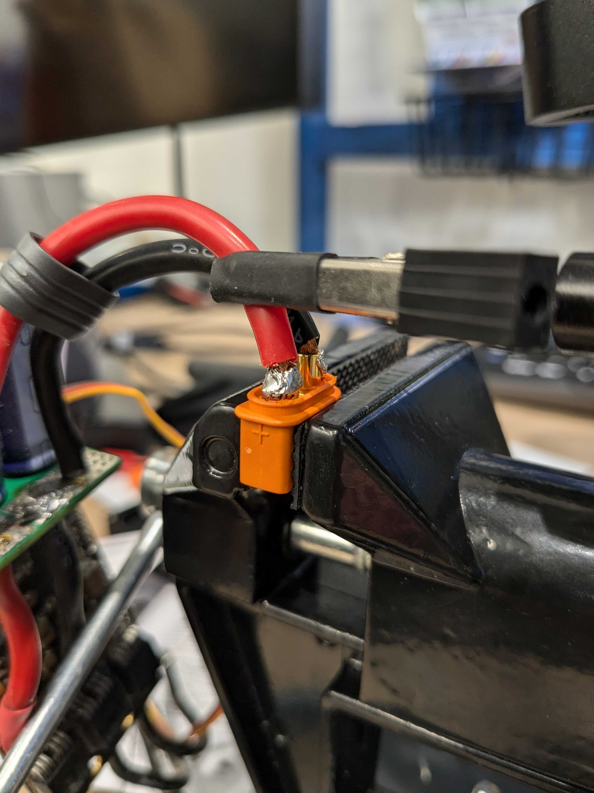
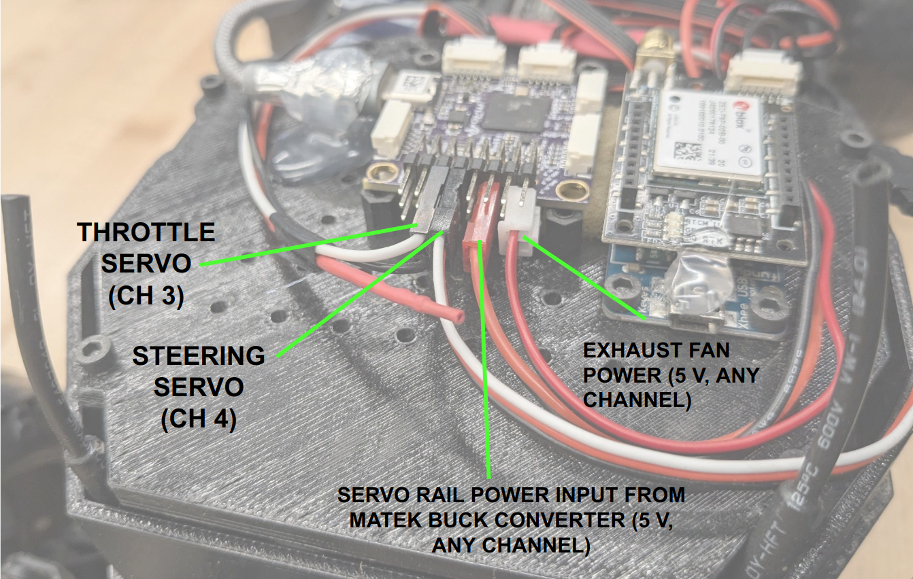
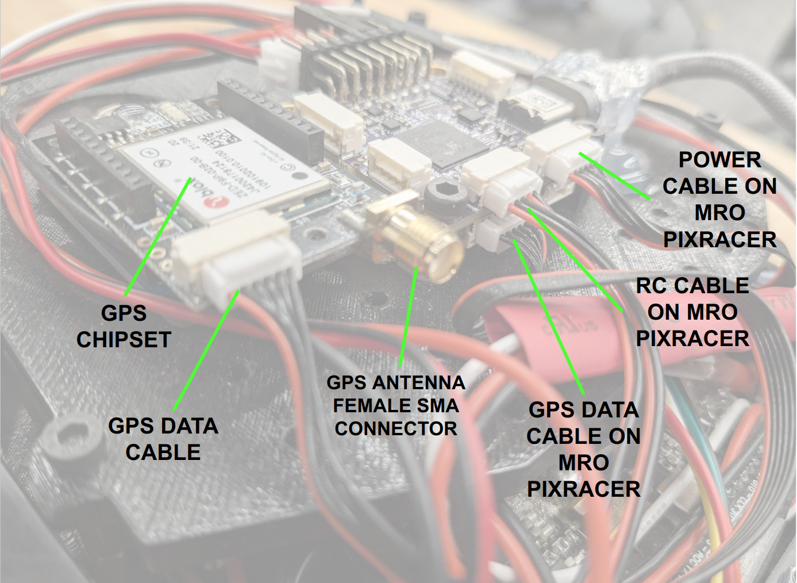
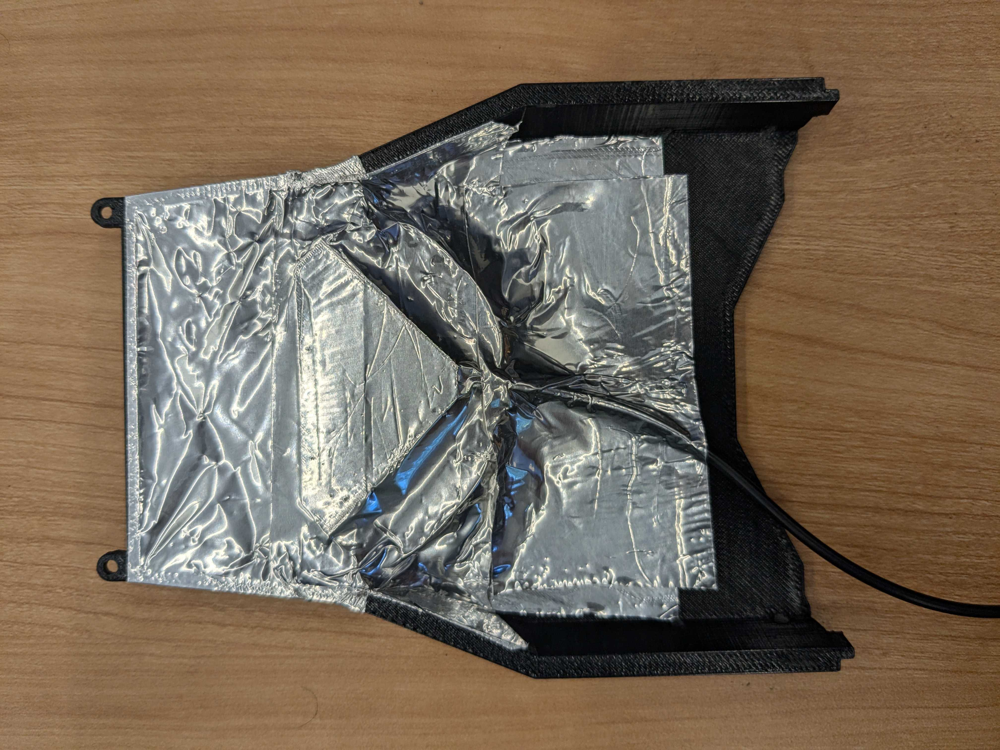
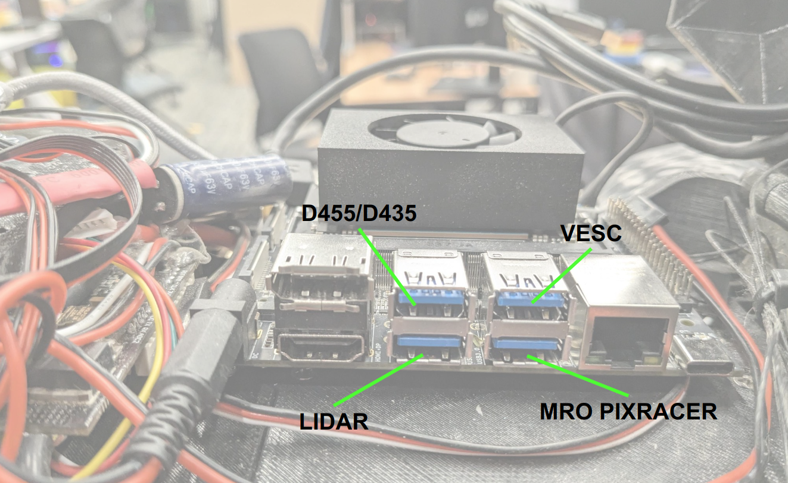
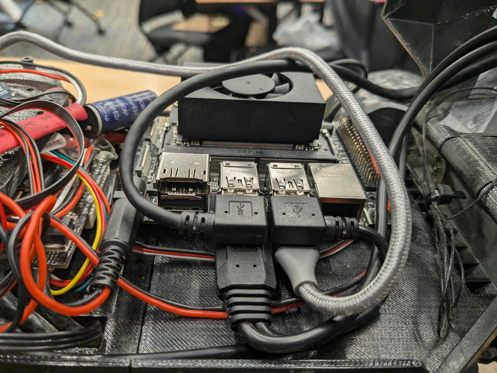

# Repository that contains hardware files associated to the HOUND project.
##### Note: If you already have a [MuSHR](https://mushr.io/), you will be re-using a fair number of the components, so do not order the highlighted components from the BOM, as they represent the "overlapping components". Additionally, you may want to order the d455 if you don't have one and want to use that.

## [Bill of materials](https://docs.google.com/spreadsheets/d/12jod9aALWGB2n3a47guYzTRTLul8M2QtT9iCGtkBhws/edit?usp=sharing)

## Build steps:
The build steps are divided into 2 parts:
1. Setting up the computers -- flashing Jetpack and the ardupilot board
2. Setting up the HOUND hardware

### Setting up the Jetson Orin NX:

1. For this, you will require one Desktop, and the Orin NX, along with its corresponding parts (WiFi card, SSD, heat sink). After that, follow [this video](https://www.youtube.com/watch?v=Ucg5Zqm9ZMk) to flash the operating system onto the module, but flash jetpack 5.1.2.
2. Due to bugs in the SDK manager, the SDK manager will likely flash the operating system, but fail to properly install the jetpack. If this happens, you just need to do the following:
   ```bash
    sudo apt update
    sudo apt-get install nvidia-jetpack
    sudo usermod -aG docker $USER
    sudo pip install jetson-stats
    sudo reboot now
    ```
3. For Ubuntu, download QGroundcontrol(QGC), for Windows (preferred), download MissionPlanner(MP).
4. Follow these instructions for [QGC](https://docs.qgroundcontrol.com/Stable_V4.3/en/qgc-user-guide/setup_view/firmware.html) and these for [MP](https://ardupilot.org/planner/docs/common-loading-firmware-onto-pixhawk.html) to flash the [custom firmware](https://github.com/prl-mushr/hound_hardware/tree/main/ardupilot_files/firmwares/mroPixracerPro) on to the MRo PixRacer Pro.
5. Follow this guide to load the [board parameters](https://github.com/prl-mushr/hound_hardware/blob/main/ardupilot_files/parameters/HOUND_mro_defaults.param) using QGC or MP onto the MRo Pixracer pro. (**TODO: insert images describing this step**)

### Setting up the Hardware:
#### Setting up the base (These steps are a WIP and will be updated as we have people in our lab build more of these platforms while trying to follow these instructions). 
We re-use some of the build steps for the MuSHR to set up the low-level platform. Follow the instructions [here](https://mushr.io/hardware/build_instructions/#servo-motor-removal) for the following components:
1. [VESC Preparation](https://mushr.io/hardware/build_instructions/#vesc-preparation): Follow the steps up to step "20", where the VESC firmware is uploaded. 
    - Instead of uploading the servo output bin file, use the [default firmware](https://github.com/prl-mushr/hound_hardware/blob/main/VESC_files/firmwares/hw_410_411_412/VESC_default.bin).
    - Instead of soldering the banana connectors, you will be soldering the IC3 connectors instead, and you will be soldering the leads from the two Matek buck converters into the same IC3 connectors, such that the VESC and the Matek buck converters are all able to get power from the same IC3 connectors. Use the color of the wire to infer polarity, red for positive, black for negative.
    Pictures for reference (make sure to strip the wire down to 14-16 gauge):
    
    
    - Using the [BLDC tool](https://github.com/vedderb/bldc-tool/tree/master) (git clone, build), upload the [hound_vesc.xml](https://github.com/prl-mushr/hound_hardware/blob/main/VESC_files/parameters/hound_vesc.xml) parameter file.
    - You may have to set up the PPM input. For this, in the bldc-tool, go to the app configuration --> PPM and set the values as shown in the image.
    - 

2. [Servo removal](https://mushr.io/hardware/build_instructions/#servo-motor-removal) and [Servo installation](https://mushr.io/hardware/build_instructions/#servo-motor-installation): Instead of throwing away the servo mount that comes with the car, attach the new, high torque sevo to it, and attach the mount back into the car. We will center the servo later, but it if you know how to center the servo, you can do it at this step as well. (**TODO: insert images describing this step**)
3. [Brushed motor removal](https://mushr.io/hardware/build_instructions/#brushed-motor-removal): Follow the steps exactly.
4. [Brushless motor installation](https://mushr.io/hardware/build_instructions/#brushless-motor-installation): Follow the instructions, however, after closing the gearbox casing, apply a bead of hot-glue along the line separating the two parts of the case, outlined in green on all sides (left, top, right). Ignore the red circles around the screws. This is done to prevent small rocks from getting into the gearbox and jamming it. (**TODO: insert images describing this step**)

<p align="center">
  
</p>

5. Setting up the Remote controller. Follow the instructions [here](https://www.youtube.com/watch?v=lxE4K7ghST0) for setting up the transmitter and receiver. Particularly, follow the instructions for:
  - [Binding](https://www.youtube.com/watch?v=lxE4K7ghST0&t=64s)
  - [Setting up the failsafe](https://www.youtube.com/watch?v=lxE4K7ghST0&t=101s) (very important!)
  - [Setting up Aux channels](https://www.youtube.com/watch?v=lxE4K7ghST0&t=203s): Set channel 5 to Switch C, channel 6 to Switch D
  - [Changing the output from PWM to PPM](https://www.youtube.com/watch?v=lxE4K7ghST0&t=468s)

#### Setting up the Lower Base:
1. Attach the front base and the rear base to the vehicle platform using the M3x40 screws
<p align="center">
  
</p>

2. Attach the front cover to the front base using the M4x40 screws
<p align="center">
  
</p>
3. Mount the VESC, exhaust fan on the rear base, and place the buck converters and R/C receiver using double sided tape as shown. Pass the motor cables through the whole marked on the right. Use the same hole to pass in the servo wires from underneath. Connect the VESC's USB wire, which will be attached to the Jetson later.

#### Note: the VESC is mounted using 10 mm standoffs. The USB port of the VESC should be facing towards the buck converters. When mounted in this pose, the capacitor bank should automatically swing away from the standoffs of the VESC. If you mount it such that the VESC is on 20 mm standoffs and the USB port is facing the jetson, the capacitor bank terminals can short against the standoffs. This alternate orientation requires use of plastic standoffs or additional insulation around the capacitor bank (hot glue works).
<p align="center">

</p>

4. Wiring:
    - Connect the other buck converter's output to the R/C receiver.
    - Using the mro pixracer pro [pinout](https://docs.mrobotics.io/autopilots/pixracer-pro.html#pinout) for reference:
      - Connect one of the Matek buck converter's 5V output to the Power rail on the MRo Pixracer pro's power rail.
      - The Power rail has Ground at the bottom, 5 V in the middle, and the signal on top.
      - Connect the steering servo wire to channel 4, and VESC wire to channel 3. Remove/cut the VESC wire's 5V line before connecting. You will likely need to use an extension wire for the servo (also included in the BOM)



5. Mount the Mid-level on the rear base using the M3x30 standoffs
<p align="center">

</p>

6. Mount the Mro Pixracer Pro as shown
Images for reference:

<p align="center">

</p>

7. Mount the D455 to the front cover as shown using the M4x8 screws
<p align="center">

</p>

8. Mount the lidar_mount_left and lidar_mount_right to the YDLiDAR as shown using M3x10 screws.
<p align="center">

</p>

9. Mount the LiDAR to the mid-section using M3x10 screws.
<p align="center">

</p>

10. Attach the mid-section to the front cover as shown
<p align="center">
  
</p>

12. Attach the rear cover to the rear base as shown.
<p align="center">

</p>

13. Mount the GPS to the GPS cover and put Aluminum tape under it: 
Image for reference:

<p align="center">

</p>

14. We use the latches and pins to attach the rear cover and the GPS cover as shown. There are latch holders on the mid-section as well. (**TODO: this step needs more sub-steps with images as it is not obvious how to attach the spring in the latch to the pin.**)
<p align="center">

</p>

15. In the holes shown here, first screw in the M2.5x5 standoffs. Then, mount the Jetson Orin NX to the standoffs using M2.5x5 screws.
<p align="center">

</p>

16. Connect the USB cables for all the devices as shown in the following images:




